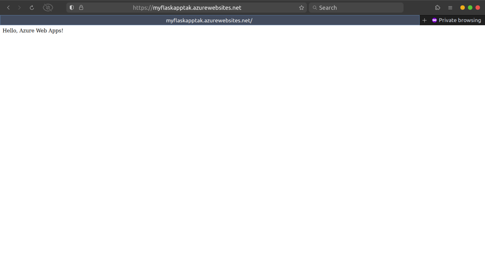

# Triluxo Technologies Private Limited - Task

This repository contains a simple Flask application deployed to Azure Web Apps as part of a task for Triluxo Technologies Private Limited.

## Application Description:

The Flask application in this repository consists of a single endpoint that returns "Hello, Azure Web Apps!" when accessed. It's a basic demonstration of deploying a Flask application to Azure Web Apps.

## Access Deployed Application:

The deployed Flask application can be accessed at [myFlaskApptak.azurewebsites.net](https://myFlaskApptak.azurewebsites.net).
## Task Showcase



## Deployment Process:

### Azure CLI Commands Used:

1. **Azure Login:**

    ```bash
    az login
    ```

    Command to log in to Azure to access your account and subscription.

2. **Create Resource Group:**

    ```bash
    az group create --name "Triluxo-Task" --location eastus
    ```

    Command to create a resource group named "Triluxo-Task" in the East US region.

3. **Create App Service Plan:**

    ```bash
    az appservice plan create --resource-group Triluxo-Task --name myAppServicePlan --sku F1 --is-linux --location eastus
    ```

    Command to create an App Service plan named "myAppServicePlan" with the F1 (Free) SKU, Linux-based, in the East US region.

4. **Create Web App:**

    ```bash
    az webapp create --resource-group Triluxo-Task --plan myAppServicePlan --name myFlaskApptak --runtime "PYTHON|3.8"
    ```

    Command to create a web app named "myFlaskApptak" within the "Triluxo-Task" resource group using the Python 3.8 runtime.

5. **Configure Deployment Source:**

    ```bash
    az webapp deployment source config --name myFlaskApptak --resource-group Triluxo-Task --repo-url https://github.com/ChinmayGajul/Triluxo-Technologies-Private-Limited---Task.git --branch main --manual-integration
    ```

    Command to configure deployment from the specified GitHub repository and branch for continuous deployment.

6. **Trigger Deployment:**

    ```bash
    az webapp deployment source sync --name myFlaskApptak --resource-group Triluxo-Task
    ```

    Command to initiate the deployment of the Flask application to the Azure Web App.
   
## Conclusion

Congratulations! You've explored the Triluxo Technologies Private Limited - Task repository showcasing a simple Flask application deployed on Azure Web Apps. 

## Contact Information

If you have any questions, suggestions, or just want to connect, feel free to reach out:

- **Author:** [Chinmay Gajul]
- **Email:** chinmaygajul11@gmail.com
- **LinkedIn:** [Your LinkedIn Profile](linkedin.com/in/chinmaygajul)

Thank you for visiting!
